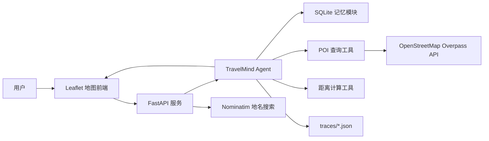
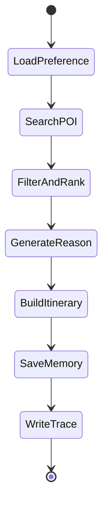

# 《企业级应用软件设计与开发》期末大作业报告

## 封面信息

| 字段 | 内容 |
| --- | --- |
| 课程名称 | 企业级应用软件设计与开发 |
| 项目名称 | TravelMind Agent：基于地图选点的城市周边旅游推荐智能体 |
| 方向 | 方向一：Agentic AI 原生开发 |
| 学号 | 2025302957 |
| 姓名 | 黄建文 |
| 专业 | 计算机技术 / 软件工程 |
| 指导教师 | 戚欣 |
| 提交日期 | 2026 年 6 月 22 日 |

## 摘要

TravelMind Agent 是一个面向城市出行场景的地图选点式旅游推荐系统。用户在地图上选择当前位置或目标地点后，系统查询周边真实 POI 数据，并结合地点类型、直线距离、评分估计和用户偏好，生成景点、美食、文化、休闲等推荐结果及简短游览路线。

本项目选择“Agentic AI 原生开发”方向，围绕一个完整的 Agent 工作流展开设计与实现。系统不是简单的问答页面，而是将地图选点、地名搜索、POI 工具调用、偏好过滤、推荐排序、推荐解释、历史记忆和执行追踪组织为一个可运行的闭环。项目采用 SDD 规格驱动开发方式，分别编写 Product Spec、Architecture Spec 和 API Spec，并通过 pytest 对核心推荐逻辑和接口进行验证。

关键词：Agentic AI；旅游推荐；OpenStreetMap；FastAPI；工具调用；SQLite 记忆；可观测性

## 目录

- [一、选题背景与设计思想](#一选题背景与设计思想)
- [二、Specs 规格文档](#二specs-规格文档)
- [三、系统架构与设计](#三系统架构与设计)
- [四、关键实现与代码展示](#四关键实现与代码展示)
- [五、测试与评估](#五测试与评估)
- [六、系统升级与扩展](#六系统升级与扩展)
- [七、课程总结](#七课程总结)
- [参考资料](#参考资料)

## 一、选题背景与设计思想

### 1.1 问题背景

在日常旅游和城市出行中，用户经常需要临时判断“当前位置附近有什么值得去的地方”。传统做法通常需要在地图软件、点评平台和旅游攻略之间反复切换：地图负责定位，点评平台负责评分，攻略平台负责推荐理由。这种方式存在明显割裂：

1. 地图搜索通常只返回地点列表，缺少面向用户偏好的解释。
2. 推荐系统往往以城市或景区为单位，不适合“我现在就在这里，附近有什么”的即时场景。
3. 用户需要手动比较距离、评分、类型和路线，决策成本较高。
4. 传统检索结果缺少执行过程记录，难以评估推荐是否合理。

TravelMind Agent 将上述问题转化为一个 Agentic AI 任务：用户给出地图选点和兴趣偏好，系统自动调用外部工具查询附近 POI，按照偏好和距离进行筛选排序，并生成可解释的推荐结果。该设计参考了大语言模型智能体中“规划、记忆、行动与工具调用”的基本思想[1-3]。

### 1.2 项目价值

本项目的价值主要体现在三个方面：

| 维度 | 项目价值 |
| --- | --- |
| 用户体验 | 用户只需在地图上点击或搜索地点，即可获得附近推荐 |
| 工程实践 | 将工具调用、状态管理、记忆和 trace 组织为完整 Agent 工作流 |
| 课程契合度 | 覆盖 SDD、Function Calling、记忆机制、多步推理、可观测性等课程要求 |

### 1.3 技术路线

项目采用轻量但完整的 Web 架构：

- 前端使用 Leaflet 和 OpenStreetMap 实现地图选点、地名搜索、当前位置定位和推荐点展示[4,6]。
- 后端使用 FastAPI 提供推荐接口、偏好接口、历史接口和地名搜索接口[7]。
- POI 数据来自 OpenStreetMap Overpass API，地名搜索来自 Nominatim[8-10]。
- 推荐 Agent 负责组织完整流程：读取偏好、调用工具、过滤排序、生成理由、构造路线、保存记忆、输出 trace。
- SQLite 用于保存用户偏好和历史推荐记录。
- pytest 用于验证距离计算、过滤逻辑、接口行为和无结果处理。

### 1.4 设计原则

项目设计遵循以下原则：

1. **真实数据优先**：推荐结果只展示 OpenStreetMap 查询到的真实 POI，不生成虚假地点。
2. **偏好严格过滤**：用户只选择美食时，只推荐餐厅、咖啡、快餐等 food 类型地点。
3. **距离含义明确**：系统显示真实经纬度直线距离，不伪装成步行或驾车距离。
4. **密钥不入库**：API Key 通过环境变量读取，`.env` 不提交到 GitHub。
5. **可测试可追踪**：核心排序逻辑可单元测试，每次推荐生成 trace 文件。

## 二、Specs 规格文档

本项目采用 SDD（规格驱动开发）思路，在编码前先明确产品边界、系统结构和接口契约。对应文档位于 `specs/` 目录。

### 2.1 Product Spec

Product Spec 主要回答“系统为谁解决什么问题”。本项目定义的目标用户是城市旅行者、校园访问者和短途出行用户。用户希望在某个地点附近快速发现值得去的景点、美食、文化和休闲场所。

核心用户目标如下：

| 用户目标 | 说明 |
| --- | --- |
| 地图选点 | 用户点击地图或搜索地名确定中心位置 |
| 周边查询 | 系统查询中心点附近 1-8km 范围内真实 POI |
| 偏好推荐 | 用户选择美食、景点、文化等偏好后获得匹配推荐 |
| 推荐解释 | 每个推荐地点包含直线距离、评分估计和推荐理由 |
| 路线草案 | 系统根据推荐结果生成简单半日游顺序 |

MVP 范围不包含商业地图真实评分、登录系统、复杂路线导航和在线支付。项目重点是展示 Agentic AI 的工程链路，而不是实现完整商业旅游平台。

### 2.2 Architecture Spec

系统采用前后端分离但部署简单的结构。FastAPI 同时提供 API 和静态页面服务，便于课程演示和本地运行。



核心模块职责如下：

| 模块 | 路径 | 职责 |
| --- | --- | --- |
| API 层 | `src/travelmind/api.py` | 提供 HTTP 接口和静态页面 |
| Agent 层 | `src/travelmind/agent.py` | 组织推荐工作流 |
| POI 工具 | `src/travelmind/tools/poi.py` | 查询并解析 Overpass POI |
| 地理编码工具 | `src/travelmind/tools/geocode.py` | 调用 Nominatim 搜索地名 |
| 距离工具 | `src/travelmind/tools/geo.py` | 使用 Haversine 计算直线距离 |
| 记忆模块 | `src/travelmind/memory.py` | 保存偏好和历史 |
| 前端页面 | `src/travelmind/static/` | 地图交互和推荐展示 |

### 2.3 API Spec

系统主要接口如下：

| 接口 | 方法 | 作用 |
| --- | --- | --- |
| `/api/health` | GET | 健康检查 |
| `/api/search` | GET | 地名搜索 |
| `/api/preferences` | GET / POST | 读取或保存用户偏好 |
| `/api/recommend` | POST | 根据地图选点生成推荐 |
| `/api/history` | GET | 获取最近推荐历史 |

推荐接口请求示例：

```json
{
  "location": {
    "lat": 30.2741,
    "lng": 120.1551,
    "label": "杭州"
  },
  "preferences": {
    "categories": ["scenic", "culture", "food"],
    "max_distance_km": 3.0,
    "pace": "balanced"
  },
  "limit": 8
}
```

推荐接口返回内容包含中心点、推荐列表、半日游路线、trace id 和数据状态。该接口是 Agent 工作流的主要入口。

## 三、系统架构与设计

### 3.1 Agent 工作流

TravelMind Agent 的核心流程不是单步函数调用，而是多阶段状态流转。每个阶段有明确输入、输出和 trace 记录。



各阶段说明：

| 阶段 | 输入 | 输出 |
| --- | --- | --- |
| LoadPreference | 用户请求 | 当前推荐偏好 |
| SearchPOI | 经纬度、半径 | 周边真实 POI |
| FilterAndRank | POI、偏好 | 排序后的推荐项 |
| GenerateReason | 推荐项 | 推荐理由 |
| BuildItinerary | 推荐项 | 简短路线顺序 |
| SaveMemory | 推荐结果 | SQLite 历史记录 |
| WriteTrace | 执行步骤 | JSON trace 文件 |

### 3.2 工具调用设计

项目中的工具调用不是模拟概念，而是落实为可执行函数：

| 工具 | 函数 | 说明 |
| --- | --- | --- |
| POI 查询工具 | `fetch_nearby_pois` | 调用 Overpass API 查询真实周边地点 |
| 地名搜索工具 | `search_places` | 调用 Nominatim 将地名转换为经纬度 |
| 距离计算工具 | `haversine_km` | 根据两组经纬度计算球面直线距离 |
| 记忆工具 | `TravelMemory` | 保存偏好和历史记录 |

Overpass 查询采用按标签类型拆分的小查询方式，避免一次性大查询导致超时。系统只展示真实地图返回的 POI；当某个偏僻地点没有结果时，前端会提示“附近没有查到符合当前偏好的真实地图地点”，不生成虚假地址。

### 3.3 推荐排序设计

推荐排序综合考虑三类因素：

1. **类型匹配**：用户选择的类别作为硬过滤条件，例如只选择美食时仅保留 food 类型。
2. **直线距离**：使用 Haversine 公式计算用户选点到 POI 的真实直线距离[5]。
3. **评分估计**：OpenStreetMap 不提供统一商业评分，因此系统根据地点名称和标签生成确定性评分估计，用于演示排序。

排序公式如下：

```text
distance_score = 1 - distance_km / max_distance_km
rating_score = (rating - 3.5) / 1.5
score = 0.55 + 0.30 * distance_score + 0.15 * rating_score
```

该公式体现了 MVP 阶段的工程取舍：先保证推荐结果符合用户类别偏好，再根据距离和评分估计排序。

### 3.4 记忆与可观测性设计

SQLite 数据库包含两类数据[11]：

- `user_preferences`：保存用户偏好。
- `recommendation_history`：保存推荐历史。

每次推荐还会生成一个 trace 文件，记录请求、执行步骤和结果摘要。示例结构如下：

```json
{
  "trace_id": "uuid",
  "request": {},
  "steps": [
    {"name": "load_memory", "status": "ok"},
    {"name": "poi_search_tool", "status": "ok"},
    {"name": "rank_candidates", "status": "ok"},
    {"name": "llm_reasoning", "status": "fallback"},
    {"name": "build_itinerary", "status": "ok"}
  ],
  "result_summary": {
    "recommendation_count": 8,
    "itinerary_count": 4
  }
}
```

这种 trace 设计便于后续进行 Agent 行为评估和问题复现。

### 3.5 前端交互设计

前端页面围绕“地图选点 + 右侧推荐面板”组织：

- 地图点击或拖拽确定中心点。
- 搜索框支持输入地名、城市、景点或地址。
- 定位按钮支持浏览器当前位置。
- 推荐结果以卡片展示，地图上同步显示编号和地点名称。
- 点击右侧卡片，地图自动定位到对应 POI。

这种设计能在 Demo 中直观展示 Agent 的输入、工具调用结果和最终推荐。

## 四、关键实现与代码展示

### 4.1 Agent 主循环

核心入口为 `TravelMindAgent.recommend`。该函数串联了偏好读取、工具调用、排序、理由生成、路线构造、记忆保存和 trace 输出。

```python
def recommend(self, request: RecommendationRequest, user_id: str = "default") -> RecommendationResponse:
    trace_id = str(uuid.uuid4())
    steps: list[AgentStep] = []

    preferences = self._merge_preferences(request.preferences, user_id)
    radius_m = int(preferences.max_distance_km * 1000)
    pois, used_fallback = fetch_nearby_pois(request.location.lat, request.location.lng, radius_m)

    ranked = self._rank_pois(pois, preferences)[: request.limit]
    enhanced = self._enhance_reasons(ranked, preferences, request.location.label)
    itinerary = self._build_itinerary(ranked, preferences)

    result = RecommendationResponse(
        center=request.location,
        recommendations=ranked,
        itinerary=itinerary,
        trace_id=trace_id,
        used_fallback_data=used_fallback,
    )
    self.memory.save_preferences(preferences, user_id=user_id)
    self.memory.save_history(request.location, result, user_id=user_id)
    self._write_trace(trace_id, request, result, steps)
    return result
```

该实现体现了 Agentic AI 的状态化执行：每一步不是孤立功能，而是围绕一个推荐目标连续推进。

### 4.2 POI 工具调用

`fetch_nearby_pois` 负责调用 OpenStreetMap Overpass API。为了减少超时，系统按标签类型拆分查询，并对返回结果去重。

```python
def fetch_nearby_pois(lat: float, lng: float, radius_m: int = 3000) -> tuple[list[POI], bool]:
    queries = _build_overpass_queries(lat, lng, radius_m)
    collected: list[POI] = []
    for query in queries:
        response = requests.post(
            settings.overpass_url,
            data={"data": query},
            timeout=settings.overpass_timeout_seconds,
            headers={"User-Agent": "TravelMindAgent/0.1"},
        )
        response.raise_for_status()
        data = response.json()
        collected.extend(_parse_overpass_elements(data.get("elements", []), lat, lng))
    pois = _dedupe_pois(collected)
    if pois:
        return pois, False
    return [], True
```

在实际代码中还包含异常处理，用于处理网络错误、Overpass 响应异常和 JSON 解析错误。

### 4.3 类型过滤与排序

推荐排序前先进行严格类型过滤。这样可以避免用户选择“美食”时出现博物馆、超市等不相关结果。

```python
def _rank_pois(self, pois: list[POI], preferences: UserPreferences) -> list[Recommendation]:
    recommendations: list[Recommendation] = []
    selected_categories = set(preferences.categories)
    for poi in pois:
        if poi.distance_km > preferences.max_distance_km:
            continue
        if selected_categories and poi.category not in selected_categories:
            continue
        distance_score = max(0.0, 1 - poi.distance_km / max(preferences.max_distance_km, 0.1))
        rating_score = (poi.rating - 3.5) / 1.5
        score = round(0.55 + 0.3 * distance_score + 0.15 * rating_score, 3)
        ...
    return sorted(recommendations, key=lambda item: item.score, reverse=True)
```

### 4.4 直线距离计算

系统使用 Haversine 公式计算真实经纬度直线距离，并在界面中明确标注“直线距离”。该距离不是步行距离或驾车距离。

```python
def haversine_km(lat1: float, lng1: float, lat2: float, lng2: float) -> float:
    radius_km = 6371.0088
    dlat = radians(lat2 - lat1)
    dlng = radians(lng2 - lng1)
    a = sin(dlat / 2) ** 2 + cos(radians(lat1)) * cos(radians(lat2)) * sin(dlng / 2) ** 2
    return 2 * radius_km * asin(sqrt(a))
```

### 4.5 API Key 安全

项目不在代码中硬编码 API Key。配置项通过 `.env` 或环境变量读取，`.env` 被 `.gitignore` 排除。配置示例如下：

```text
TRAVELMIND_LLM_API_KEY=
TRAVELMIND_LLM_BASE_URL=https://api.deepseek.com/chat/completions
TRAVELMIND_LLM_MODEL=deepseek-chat
TRAVELMIND_LLM_TIMEOUT=15
```

### 4.6 AI IDE 使用情况

开发过程中使用 AI IDE 辅助完成以下工作：

- 根据课程要求拆解项目题目和系统边界。
- 按 SDD 思路生成 Product Spec、Architecture Spec 和 API Spec。
- 辅助实现 FastAPI 后端、Leaflet 前端和测试用例。
- 根据实际测试反馈修正推荐逻辑，例如取消虚假 fallback 地点、明确直线距离、严格按用户偏好过滤。

在报告最终版中，可补充 AI IDE 使用截图，包括项目目录、代码编辑界面、测试运行结果和浏览器 Demo 页面。

## 五、测试与评估

### 5.1 测试环境

| 项目 | 内容 |
| --- | --- |
| Python 环境 | `D:\anaconda\envs\sam2` |
| 测试框架 | pytest |
| API 测试工具 | FastAPI TestClient |
| 运行命令 | `D:\anaconda\envs\sam2\python.exe -m pytest -q` |

### 5.2 测试结果

当前测试使用 pytest 框架完成[12]，运行结果：

```text
7 passed, 1 warning
```

其中 warning 来自 FastAPI / Starlette 测试客户端兼容提示，不影响系统功能。

### 5.3 测试用例设计

| 测试项 | 对应文件 | 验证内容 |
| --- | --- | --- |
| 距离计算 | `tests/test_agent.py` | Haversine 计算结果在合理范围 |
| 推荐 trace | `tests/test_agent.py` | 推荐后生成 trace 文件 |
| 类型过滤 | `tests/test_agent.py` | 只选美食时不返回购物或文化地点 |
| 无结果处理 | `tests/test_agent.py` | 查不到真实 POI 时不生成假地点 |
| 健康检查 | `tests/test_api.py` | `/api/health` 正常返回 |
| 推荐接口 | `tests/test_api.py` | `/api/recommend` 返回推荐结构 |
| 地名搜索 | `tests/test_api.py` | `/api/search` 返回地理编码结果 |

### 5.4 行为评估

在手动测试中，选择杭州西湖附近作为中心点，系统能够返回真实 POI，如浙江省博物馆、西泠印社、平湖秋月、中国印学博物馆等。选择武汉部分高校附近时，系统能够返回麦当劳、肯德基、烧烤店、火锅店等 food 类型地点。

针对测试过程中发现的问题，进行了如下修正：

| 问题 | 修正方式 |
| --- | --- |
| 地图默认 marker 图片加载失败 | 改为自定义 HTML marker |
| 不支持地名搜索 | 增加 Nominatim 搜索接口 |
| 不支持当前位置 | 增加浏览器定位按钮 |
| 只选美食却出现博物馆、超市 | 增加严格类型过滤 |
| 偏僻地点出现虚假地址 | 取消真实接口路径中的假数据 fallback |
| 距离含义不清 | 统一标注为直线距离 |

### 5.5 评估结论

测试结果表明，系统已经实现课程项目 MVP 的核心目标：用户可以通过地图选点触发 Agent 推荐流程，系统能够调用真实地图数据、按照偏好过滤、生成解释并保存执行轨迹。当前限制主要来自免费 OpenStreetMap 数据质量和 Overpass 服务稳定性，在商业级应用中可替换为高德、腾讯、Google Places 等更稳定的数据源。

## 六、系统升级与扩展

### 6.1 数据源升级

当前 POI 数据来自 OpenStreetMap，优点是免费、开放、无需商业 Key，适合课程项目。后续可升级为：

- 高德地图 POI 搜索：适合国内地点覆盖。
- 腾讯位置服务：适合国内路线和地点数据。
- Google Places API：适合国际地点和评分数据。

升级后可获得更准确的营业时间、用户评分、评论数量和导航距离。

### 6.2 路线规划升级

当前路线是基于推荐结果的简单排序，并不计算真实步行路线。后续可接入 OSRM 或商业地图路线 API，实现：

- 步行距离和预计时间。
- 多地点路线优化。
- 半日游、一日游自动规划。
- 路线地图绘制。

### 6.3 Agent 框架升级

当前项目采用轻量级状态流实现 Agent 工作流。后续可使用 LangGraph 进行显式状态机建模：

- 将 LoadPreference、SearchPOI、RankCandidates、GenerateReason、BuildItinerary 等步骤定义为图节点。
- 增加异常分支，例如 Overpass 失败后切换数据源。
- 增加人工确认节点，让用户调整偏好后重新规划。

### 6.4 记忆机制升级

当前记忆保存用户偏好和历史记录。后续可扩展为：

- 多用户登录。
- 长期兴趣画像。
- 收藏地点。
- “不再推荐类似地点”的负反馈机制。
- 基于历史行为的个性化排序。

### 6.5 可观测性升级

当前 trace 以 JSON 文件保存。后续可接入 LLMOps 或可视化面板：

- 请求耗时统计。
- 工具调用成功率。
- 推荐结果点击率。
- 不同偏好下的推荐质量评估。

## 七、课程总结

### 7.1 工程思维变化

通过本项目，我对 Agentic AI 开发的理解从“让模型回答问题”转向“设计一个可执行、可测试、可追踪的任务系统”。TravelMind Agent 并不是单纯调用大模型生成文字，而是把地图、POI 查询、距离计算、偏好过滤、推荐排序、理由生成和记忆模块组织为一个完整流程。

### 7.2 SDD 方法收获

SDD 的价值在本项目中比较明显。先写 Product Spec 可以明确系统边界，避免一开始就做过大的旅游平台；Architecture Spec 帮助划分前端、API、Agent、工具和记忆模块；API Spec 则让前后端交互更稳定。后续修改推荐逻辑时，也能围绕规格判断哪些行为应该保留，哪些行为需要修正。

### 7.3 对 Agentic AI 的理解

Agentic AI 系统的关键不只是语言模型，而是“模型 + 工具 + 状态 + 记忆 + 评估”的组合。本项目中，POI 查询工具提供外部世界信息，距离工具提供可验证计算，SQLite 提供记忆，trace 提供可观测性。大模型可以增强推荐理由，但系统的可靠性不能完全依赖大模型输出。

### 7.4 不足与反思

当前项目仍然有一些不足：

1. 使用免费地图数据源，部分偏僻地点 POI 覆盖不完整。
2. 评分是估计值，不是真实用户评分。
3. 路线只是简单顺序，不是真实步行路线规划。
4. 没有多用户登录和长期画像。
5. 前端界面仍以课程 Demo 为主，尚未达到完整商业产品体验。

这些不足也说明，Agentic AI 原生开发需要同时关注 AI 能力、数据质量和工程系统可靠性。

### 7.5 课程建议

建议课程后续可以增加更多 Agent 评估实践，例如如何设计 benchmark、如何评估工具调用成功率、如何评估推荐解释是否可靠。相比单纯完成 Demo，这些内容更能体现企业级 Agent 应用开发的工程价值。

## 参考资料

[1] WANG L, MA C, FENG X, et al. A survey on large language model based autonomous agents[J]. Frontiers of Computer Science, 2024, 18(6): 186345. DOI:10.1007/s11704-024-40231-1.

[2] YAO S, ZHAO J, YU D, et al. ReAct: Synergizing reasoning and acting in language models[C]//The Eleventh International Conference on Learning Representations. Kigali: OpenReview.net, 2023.

[3] SCHICK T, DWIVEDI-YU J, DESSÌ R, et al. Toolformer: Language models can teach themselves to use tools[C]//Advances in Neural Information Processing Systems 36. New Orleans: Curran Associates, 2023.

[4] HAKLAY M, WEBER P. OpenStreetMap: User-generated street maps[J]. IEEE Pervasive Computing, 2008, 7(4): 12-18. DOI:10.1109/MPRV.2008.80.

[5] SINNOTT R W. Virtues of the haversine[J]. Sky & Telescope, 1984, 68(2): 159.

[6] LEAFLET. Leaflet API reference 1.9.4[EB/OL]. [2026-06-18]. https://leafletjs.com/reference.html.

[7] FASTAPI. FastAPI documentation[EB/OL]. [2026-06-18]. https://fastapi.tiangolo.com/.

[8] OPENSTREETMAP WIKI. Overpass API[EB/OL]. [2026-06-18]. https://wiki.openstreetmap.org/wiki/Overpass_API.

[9] NOMINATIM. Search API manual[EB/OL]. [2026-06-18]. https://nominatim.org/release-docs/latest/api/Search/.

[10] OPENSTREETMAP FOUNDATION. Nominatim usage policy[EB/OL]. [2026-06-18]. https://operations.osmfoundation.org/policies/nominatim/.

[11] SQLITE. SQLite documentation[EB/OL]. [2026-06-18]. https://sqlite.org/docs.html.

[12] PYTEST DEVELOPMENT TEAM. pytest documentation[EB/OL]. [2026-06-18]. https://docs.pytest.org/.
