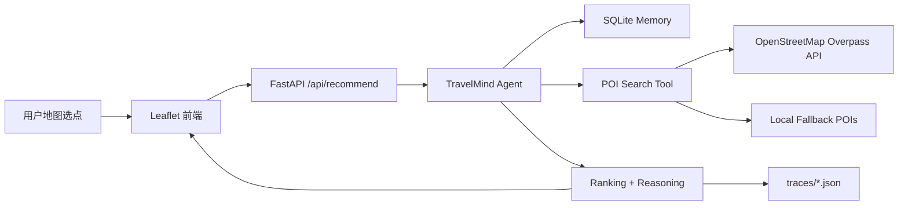
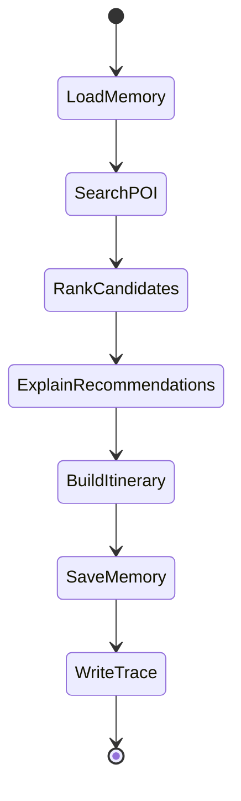

# Architecture Spec: TravelMind Agent

## 1. 总体架构

## 2. Agent 状态流

## 3. 核心模块

| 模块 | 路径 | 职责 |
| --- | --- | --- |
| API | `src/travelmind/api.py` | HTTP 路由、静态资源服务 |
| Agent | `src/travelmind/agent.py` | 多步推荐工作流 |
| Memory | `src/travelmind/memory.py` | 用户偏好与历史记录 |
| POI Tool | `src/travelmind/tools/poi.py` | Overpass 查询与 fallback |
| Geo Tool | `src/travelmind/tools/geo.py` | 距离计算 |
| Schemas | `src/travelmind/schemas.py` | 请求与响应模型 |

## 4. Agentic AI 要素

- 工具调用：POI Search Tool、Geo Tool、Memory Tool。
- 状态管理：推荐请求在 load/search/rank/explain/itinerary/save/trace 间流转。
- 记忆机制：SQLite 持久化用户偏好与历史推荐。
- 多步推理：地点识别、候选召回、排序、理由生成、路线组织。
- 可观测性：每次推荐生成 trace JSON。

## 5. 数据流

1. 前端发送经纬度、偏好、半径和节奏。
2. 后端读取用户历史偏好。
3. Agent 调用 POI 工具查询周边地点。
4. Agent 根据距离、评分估计和偏好计算推荐分。
5. Agent 生成推荐理由和半日游路线。
6. 系统保存偏好、历史和 trace，并返回结果。
